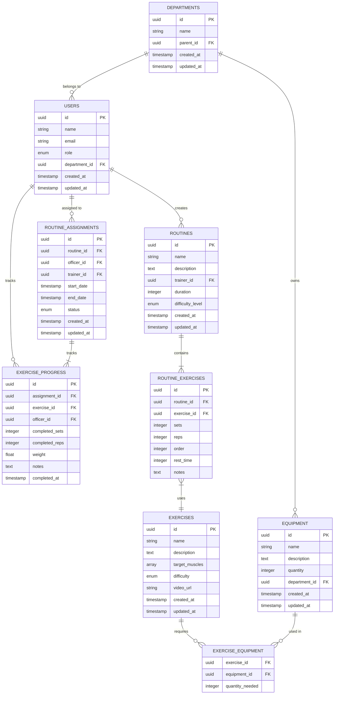

# Database Schema Analysis for Police Workout App V1

## Current Schema Analysis

### Core Tables and Relations

```typescript
// Current Basic Schema Structure
interface User {
  id: string;
  name: string;
  email: string;
  role: UserRole; // [ADMIN, TRAINER, OFFICER]
  departmentId: string;
  createdAt: Date;
  updatedAt: Date;
}

interface Exercise {
  id: string;
  name: string;
  description: string;
  targetMuscles: string[];
  difficulty: DifficultyLevel;
  equipmentNeeded: string[];
  videoUrl?: string;
  createdAt: Date;
  updatedAt: Date;
}

interface Routine {
  id: string;
  name: string;
  description: string;
  trainerId: string;
  exercises: RoutineExercise[];
  duration: number;
  difficultyLevel: DifficultyLevel;
  createdAt: Date;
  updatedAt: Date;
}

interface RoutineExercise {
  id: string;
  routineId: string;
  exerciseId: string;
  sets: number;
  reps: number;
  order: number;
  restTime: number;
  notes?: string;
}

interface RoutineAssignment {
  id: string;
  routineId: string;
  officerId: string;
  trainerId: string;
  startDate: Date;
  endDate: Date;
  status: AssignmentStatus;
  createdAt: Date;
  updatedAt: Date;
}

interface ExerciseProgress {
  id: string;
  assignmentId: string;
  exerciseId: string;
  officerId: string;
  completedSets: number;
  completedReps: number;
  weight?: number;
  notes?: string;
  completedAt: Date;
}
```

## Strengths of Current Schema

1. Basic Relationships Coverage

   - User management (Officers and Trainers)
   - Exercise library
   - Routine creation
   - Assignment tracking
   - Progress monitoring

2. Temporal Tracking

   - Creation and update timestamps
   - Assignment periods
   - Progress tracking dates

3. Flexible Exercise Structure
   - Support for different exercise types
   - Equipment tracking
   - Difficulty levels

## Potential Issues and Limitations

1. Data Integrity Concerns

   - No foreign key constraints specified
   - Missing cascade delete policies
   - No soft delete implementation

2. Performance Considerations

   - Array fields might cause query performance issues
   - Missing proper indexing strategy
   - No partitioning strategy for historical data

3. Missing Essential Relations
   - No department hierarchy
   - Missing equipment inventory tracking
   - No user authentication/authorization tables
   - No audit logging structure

## Recommended Schema Enhancements

```sql
-- Authentication
CREATE TABLE auth_credentials (
    id UUID PRIMARY KEY,
    user_id UUID REFERENCES users(id),
    password_hash TEXT NOT NULL,
    last_login TIMESTAMP,
    is_active BOOLEAN DEFAULT true,
    mfa_enabled BOOLEAN DEFAULT false
);

-- Departments
CREATE TABLE departments (
    id UUID PRIMARY KEY,
    name VARCHAR(255) NOT NULL,
    parent_id UUID REFERENCES departments(id),
    created_at TIMESTAMP DEFAULT CURRENT_TIMESTAMP,
    updated_at TIMESTAMP DEFAULT CURRENT_TIMESTAMP
);

-- Equipment
CREATE TABLE equipment (
    id UUID PRIMARY KEY,
    name VARCHAR(255) NOT NULL,
    description TEXT,
    quantity INTEGER NOT NULL DEFAULT 0,
    department_id UUID REFERENCES departments(id),
    created_at TIMESTAMP DEFAULT CURRENT_TIMESTAMP,
    updated_at TIMESTAMP DEFAULT CURRENT_TIMESTAMP
);

-- Exercise Equipment Relation
CREATE TABLE exercise_equipment (
    exercise_id UUID REFERENCES exercises(id),
    equipment_id UUID REFERENCES equipment(id),
    quantity_needed INTEGER DEFAULT 1,
    PRIMARY KEY (exercise_id, equipment_id)
);
```

## Entity Relationship Diagram



## V1 Implementation Recommendations

1. Add Indexes

```sql
-- Performance Indexes
CREATE INDEX idx_routine_assignments_officer ON routine_assignments(officer_id);
CREATE INDEX idx_routine_assignments_trainer ON routine_assignments(trainer_id);
CREATE INDEX idx_exercise_progress_assignment ON exercise_progress(assignment_id);
CREATE INDEX idx_users_department ON users(department_id);
```

2. Add Constraints

```sql
-- Data Integrity Constraints
ALTER TABLE routine_assignments
ADD CONSTRAINT valid_dates
CHECK (start_date < end_date);

ALTER TABLE exercise_progress
ADD CONSTRAINT valid_sets_reps
CHECK (completed_sets > 0 AND completed_reps > 0);
```

3. Add Soft Delete

```sql
-- Add to relevant tables
ALTER TABLE users ADD COLUMN deleted_at TIMESTAMP;
ALTER TABLE routines ADD COLUMN deleted_at TIMESTAMP;
ALTER TABLE exercises ADD COLUMN deleted_at TIMESTAMP;
```

## Schema Robustness Assessment

### Strengths for V1

1. Covers core functionality
2. Supports basic workout management
3. Enables progress tracking
4. Maintains data relationships
5. Supports equipment management

### Potential Challenges

1. Large dataset performance
2. Complex queries for reports
3. Historical data management
4. Concurrent updates handling
5. Backup and recovery complexity

### Recommendations for V2

1. Implement partitioning for historical data
2. Add materialized views for reporting
3. Implement event sourcing for audit
4. Add caching layer
5. Implement data archival strategy
