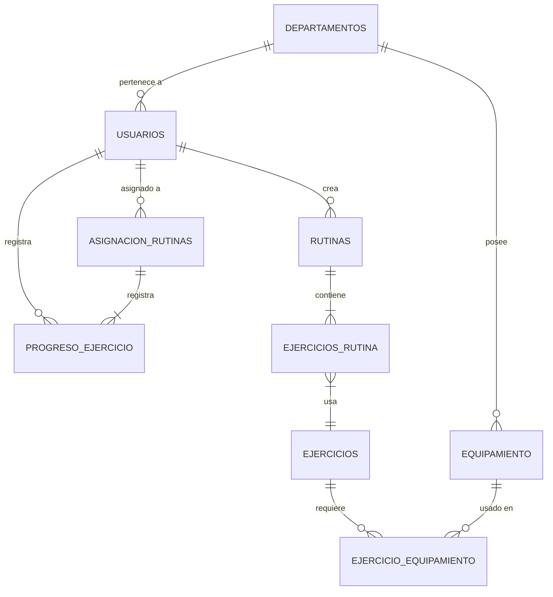

# Análisis del Esquema de Base de Datos para App de Entrenamiento Policial V1

## Análisis del Esquema Actual

### Tablas Principales y Relaciones

```typescript
// Estructura Básica del Esquema Actual
interface Usuario {
  id: string;
  nombre: string;
  email: string;
  rol: RolUsuario; // [ADMIN, ENTRENADOR, OFICIAL]
  departamentoId: string;
  creadoEn: Date;
  actualizadoEn: Date;
}

interface Ejercicio {
  id: string;
  nombre: string;
  descripcion: string;
  musculosObjetivo: string[];
  dificultad: NivelDificultad;
  equipamientoNecesario: string[];
  urlVideo?: string;
  creadoEn: Date;
  actualizadoEn: Date;
}

interface Rutina {
  id: string;
  nombre: string;
  descripcion: string;
  entrenadorId: string;
  ejercicios: EjercicioRutina[];
  duracion: number;
  nivelDificultad: NivelDificultad;
  creadoEn: Date;
  actualizadoEn: Date;
}

interface EjercicioRutina {
  id: string;
  rutinaId: string;
  ejercicioId: string;
  series: number;
  repeticiones: number;
  orden: number;
  tiempoDescanso: number;
  notas?: string;
}

interface AsignacionRutina {
  id: string;
  rutinaId: string;
  oficialId: string;
  entrenadorId: string;
  fechaInicio: Date;
  fechaFin: Date;
  estado: EstadoAsignacion;
  creadoEn: Date;
  actualizadoEn: Date;
}

interface ProgresoEjercicio {
  id: string;
  asignacionId: string;
  ejercicioId: string;
  oficialId: string;
  seriesCompletadas: number;
  repeticionesCompletadas: number;
  peso?: number;
  notas?: string;
  completadoEn: Date;
}
```

## Fortalezas del Esquema Actual

1. Cobertura de Relaciones Básicas

   - Gestión de usuarios (Oficiales y Entrenadores)
   - Biblioteca de ejercicios
   - Creación de rutinas
   - Seguimiento de asignaciones
   - Monitoreo de progreso

2. Seguimiento Temporal

   - Marcas de tiempo de creación y actualización
   - Períodos de asignación
   - Fechas de seguimiento de progreso

3. Estructura Flexible de Ejercicios
   - Soporte para diferentes tipos de ejercicios
   - Seguimiento de equipamiento
   - Niveles de dificultad

## Problemas y Limitaciones Potenciales

1. Preocupaciones de Integridad de Datos

   - No se especifican restricciones de clave foránea
   - Faltan políticas de eliminación en cascada
   - No hay implementación de borrado suave

2. Consideraciones de Rendimiento

   - Los campos de tipo array pueden causar problemas de rendimiento en consultas
   - Falta estrategia de indexación adecuada
   - No hay estrategia de particionamiento para datos históricos

3. Relaciones Esenciales Faltantes
   - Sin jerarquía departamental
   - Falta seguimiento de inventario de equipamiento
   - Sin tablas de autenticación/autorización de usuarios
   - Sin estructura de registro de auditoría

## Mejoras Recomendadas del Esquema

```sql
-- Autenticación
CREATE TABLE credenciales_auth (
    id UUID PRIMARY KEY,
    usuario_id UUID REFERENCES usuarios(id),
    hash_password TEXT NOT NULL,
    ultimo_login TIMESTAMP,
    esta_activo BOOLEAN DEFAULT true,
    mfa_habilitado BOOLEAN DEFAULT false
);

-- Departamentos
CREATE TABLE departamentos (
    id UUID PRIMARY KEY,
    nombre VARCHAR(255) NOT NULL,
    id_padre UUID REFERENCES departamentos(id),
    creado_en TIMESTAMP DEFAULT CURRENT_TIMESTAMP,
    actualizado_en TIMESTAMP DEFAULT CURRENT_TIMESTAMP
);

-- Equipamiento
CREATE TABLE equipamiento (
    id UUID PRIMARY KEY,
    nombre VARCHAR(255) NOT NULL,
    descripcion TEXT,
    cantidad INTEGER NOT NULL DEFAULT 0,
    departamento_id UUID REFERENCES departamentos(id),
    creado_en TIMESTAMP DEFAULT CURRENT_TIMESTAMP,
    actualizado_en TIMESTAMP DEFAULT CURRENT_TIMESTAMP
);

-- Relación Ejercicio-Equipamiento
CREATE TABLE ejercicio_equipamiento (
    ejercicio_id UUID REFERENCES ejercicios(id),
    equipamiento_id UUID REFERENCES equipamiento(id),
    cantidad_necesaria INTEGER DEFAULT 1,
    PRIMARY KEY (ejercicio_id, equipamiento_id)
);
```

## Diagrama de Relaciones de Entidad



## Recomendaciones de Implementación V1

1. Agregar Índices

```sql
-- Índices de Rendimiento
CREATE INDEX idx_asignacion_rutinas_oficial ON asignacion_rutinas(oficial_id);
CREATE INDEX idx_asignacion_rutinas_entrenador ON asignacion_rutinas(entrenador_id);
CREATE INDEX idx_progreso_ejercicio_asignacion ON progreso_ejercicio(asignacion_id);
CREATE INDEX idx_usuarios_departamento ON usuarios(departamento_id);
```

2. Agregar Restricciones

```sql
-- Restricciones de Integridad de Datos
ALTER TABLE asignacion_rutinas
ADD CONSTRAINT fechas_validas
CHECK (fecha_inicio < fecha_fin);

ALTER TABLE progreso_ejercicio
ADD CONSTRAINT series_reps_validas
CHECK (series_completadas > 0 AND repeticiones_completadas > 0);
```

3. Agregar Borrado Suave

```sql
-- Agregar a tablas relevantes
ALTER TABLE usuarios ADD COLUMN eliminado_en TIMESTAMP;
ALTER TABLE rutinas ADD COLUMN eliminado_en TIMESTAMP;
ALTER TABLE ejercicios ADD COLUMN eliminado_en TIMESTAMP;
```

## Evaluación de Robustez del Esquema

### Fortalezas para V1

1. Cubre funcionalidad central
2. Soporta gestión básica de entrenamientos
3. Permite seguimiento de progreso
4. Mantiene relaciones de datos
5. Soporta gestión de equipamiento

### Desafíos Potenciales

1. Rendimiento con grandes conjuntos de datos
2. Consultas complejas para reportes
3. Gestión de datos históricos
4. Manejo de actualizaciones concurrentes
5. Complejidad de respaldo y recuperación

### Recomendaciones para V2

1. Implementar particionamiento para datos históricos
2. Agregar vistas materializadas para reportes
3. Implementar event sourcing para auditoría
4. Agregar capa de caché
5. Implementar estrategia de archivado de datos

## Conclusión

El esquema propuesto proporciona una base sólida para la versión 1 de la aplicación, cubriendo las necesidades básicas de gestión de entrenamientos mientras mantiene la integridad y las relaciones de datos. Las mejoras sugeridas deberían implementarse de manera incremental, priorizando aquellas que afecten directamente al rendimiento y la integridad de los datos.
